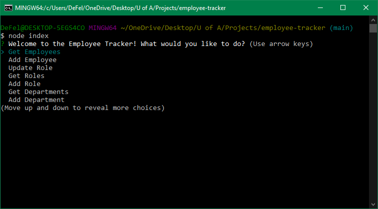

  # Employee Tracker 

  ## Description
  A node application designed to manipulate employee data in a sequal database
  
  
  ## Installation
  Packages required to run this program are: run sql files, npm install

  ## Technologies Used
  Inquirer, MySQL

  ## License
  MIT

  ## Tests
  To execute, run the following command: node index

  ## Contributors
  Joseph DeFelice

  ## Contact
  If you have any questions, contact the author directly at defelicejoseph@outlook.com.